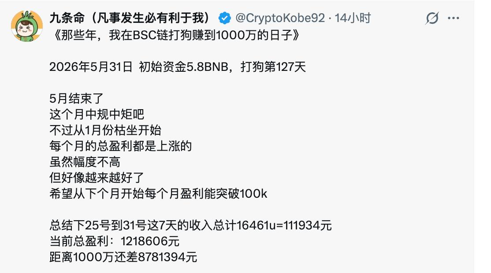
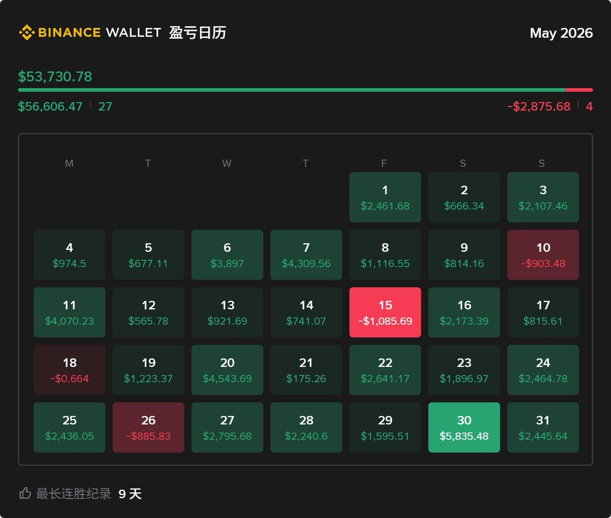

# 一个下午，把「BSC 打狗赚千万」传说拆成链上研究

> 从一条 X 信息源开始，到 BscScan 数据、BSC receipt logs、Four.meme 事件解析、买入节点分桶，再到公开 GitHub Pages 报告。

线上报告：<https://hahahakang.github.io/bsc-fourmeme-analysis/>

---

## 1. 故事从一条 X 开始

2026 年 5 月 31 日，我在 X 上看到一个 BSC 交易员的复盘。

他说自己从 `5.8 BNB` 开始，在 BSC 链上连续「打狗」127 天，当前累计盈利已经超过 `120 万人民币`，目标是做到 `1000 万`。

这类内容在加密社区很常见。第一眼看很燃，第二眼也很容易让人怀疑：

- 这是真实收益，还是截图叙事？
- 如果真实，钱到底是在哪个阶段赚到的？
- 是靠 100k、200k、1m、5m 这些确认节点，还是更早的内盘阶段？
- 如果要开发交易辅助系统，应该学习他的什么，而不是盲目跟单？

原始信息源如下：

他同时贴了一张 Binance Wallet 的 5 月盈亏日历：

截图当然不能直接证明一套策略成立。

但链上世界有一个好处：只要钱包地址公开，我们可以把故事拆成数据。

---

## 2. 我做了什么

这不是一个「看图点评」项目，而是一次从公开线索到链上复盘的完整小实验。

大致流程如下：

1. 从 X 信息源出发，定位公开 BSC 钱包地址。
2. 从 BscScan 下载 2026 年 1 月至 6 月的普通交易 CSV。
3. 合并并去重 4 份交易文件，得到 `17,933` 笔唯一交易。
4. 通过 BSC RPC 拉取交易 receipt，缓存 `10,637` 份链上回执。
5. 从 receipt logs 中解析 token transfer 和 Four.meme 交易事件。
6. 重建钱包在 Four.meme 上的买入、卖出、费用和 token 流向。
7. 对每个 token 找出第一次买入时间和买入时 FDV。
8. 按买入 FDV 分桶，观察哪个节点真正贡献利润。
9. 生成 CSV、Excel 和可公开访问的 GitHub Pages 报告。

最终在线报告在这里：

<https://hahahakang.github.io/bsc-fourmeme-analysis/>

---

## 3. 关键发现

直觉上，很多人会以为这种交易员靠的是 `100k`、`200k`、`1m`、`5m` 这类「确认节点」赚钱。

但这个样本给出的答案不是这样。

在严格匹配 Four.meme 交易的口径下，利润主要来自更早的 `0-50k FDV` 阶段。

| 首次买入 FDV 桶 | token 数 | 胜率 | 总收益 |
| --- | ---: | ---: | ---: |
| 0-50k | 2,841 | 40.7% | +97.72 BNB |
| 50k-100k | 63 | 19.0% | -6.99 BNB |
| 100k-200k | 32 | 28.1% | -10.33 BNB |
| 200k-1m | 17 | 47.1% | +0.27 BNB |
| 1m-5m | 5 | 60.0% | +0.21 BNB |
| 5m+ | 7 | 14.3% | -18.53 BNB |

严格 Four.meme 匹配口径下，样本总计约 `+62.34 BNB`。

这不是完整钱包净值审计，因为它没有对未卖出的残余仓位做当前价格标记，也没有把所有非 Four.meme 交易都纳入。但它足够说明一个核心问题：

**这套打法不是高胜率神话，而是超早期内盘阶段的低胜率、高赔率、高频试错。**

---

## 4. 我的理解

这个地址更像是一个「内盘早期猎手」，而不是传统意义上的趋势追高选手。

它的优势不在于每个币都看得准，而在于：

- 足够早地进入 0-50k FDV 区间；
- 对大量标的进行小仓试错；
- 接受大量小亏和无效交易；
- 在少数大赢家出现时，让赔率覆盖亏损；
- 通过分批卖出把浮盈转成真实链上现金流。

这也解释了为什么简单跟单很危险。

如果你是在他买入之后很久才看到信号，或者等到 100k、200k、1m 以后才追，拿到的赔率结构已经不是他原来的赔率结构。

换句话说，真正值得学习的不是「他买了哪个币」，而是：

- 他在什么阶段买；
- 那一刻池子是什么状态；
- 那一刻其他地址如何参与；
- 他如何处理失败样本；
- 他如何退出大赢家。

---

## 5. 如果要做机器人，应该做什么

我现在更倾向于做一个「研究辅助系统」，而不是无脑跟单机器人。

一个合理方向可能是：

1. 实时扫描 Four.meme 新币。
2. 记录 0-50k FDV 阶段的早期交易状态。
3. 观察池子 BNB、买盘速度、早期地址结构。
4. 排除明显异常盘和低质量盘。
5. 给新币做评分，而不是直接自动梭哈。
6. 把最后决策留给人，机器人负责减少信息噪音。

机器人不应该替人赌博。

更好的机器人，是把链上混乱信号整理成可比较、可复盘、可迭代的数据。

---

## 6. 项目里有什么

这个仓库是公开研究版本，不包含原始 RPC receipt 缓存和完整中间大文件，只保留适合复核和协作的结果。

- `index.html`: GitHub Pages 在线报告首页
- `data/buy_detail_with_fdv.csv`: 每笔买入明细，含买入时间、token、买入 FDV、池子流动性估算
- `data/token_trade_summary.csv`: token 级收益汇总
- `data/fdv_bucket_summary.csv`: 买入 FDV 分桶结果
- `data/top_winners.csv`: 最大盈利样本
- `data/top_losers.csv`: 最大亏损样本
- `downloads/bsc_blogger_trade_analysis.xlsx`: 完整 Excel 工作簿
- `assets/`: 原始信息源截图

---

## 7. 口径说明

几个重要限制需要提前说清楚：

- 买入市值使用链上成交价乘以 token 总供应量近似，属于 FDV 口径，不等于严格流通市值。
- 收益为已匹配 Four.meme 交易的链上现金流。
- 未卖出的残余 token 没有按当前价格重新标记。
- 部分高 FDV 样本可能包含中间币、稳定币或异常交易，需要人工复核。
- 本研究不构成投资建议，也不鼓励无脑跟单。

---

## 8. 欢迎一起改进

我最希望后续继续改进的方向有几个：

1. 复核 `0-50k` 大赢家的共同特征。
2. 区分内盘选手和外盘选手。
3. 对高 FDV 亏损样本做异常标注。
4. 引入更多链上信号，比如创建者行为、早期买家画像、迁移状态。
5. 逐步把它做成一个新币评分模型，而不是单纯的事后复盘。

如果你对 BSC meme、Four.meme、链上数据分析或交易辅助系统感兴趣，欢迎提 Issue 或 PR。

这个项目最有意思的地方，不是证明某个人多厉害。

而是说明一件事：

**一个看起来像传说的交易故事，可以被拆成别人能检查、复现、质疑和改进的数据。**
